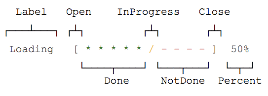
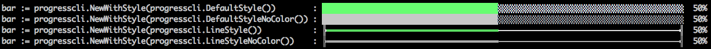

# Progress CLI

[](https://goreportcard.com/report/github.com/nathan-fiscaletti/progresscli-go)
[](https://godoc.org/github.com/nathan-fiscaletti/progresscli-go)

Progress CLI gives you the ability to add customized progress bars to your CLI application.

## Installation

```sh
$ go get github.com/nathan-fiscaletti/progresscli-go
```

## Basic Usage

```go
package main

import(
    "time"

    "github.com/nathan-fiscaletti/progresscli-go"
)

func main() {
    bar := progresscli.New()
    bar.Show()

    for i := float64(0); i < bar.GetMax(); i++ {
        bar.Increment(1)
        time.Sleep(time.Millisecond * 25)
    }
}
```

## Custom Styles

You can implement your own Style for the Progress bar.

There are several components that make up the progress bar. 



The style that would make up the above progress bar would look like this:

```go
bar.SetLabel("Loading")
bar.SetStyle(progresscli.Style{
    OpenChar: "[",
    CloseChar: "]",
    DoneChar: "*",
    NotDoneChar: "-",
    InProgressChar: "/",
    PercentageColor: "",
})
```

You can customize the characters used and the bar will automatically adjust it's size accordingly. This includes using multiple characters for different components of the progress bar.

**There are several built in progress bar styles that you can make use of.**



## Controlling the Progress Bar

You can set the progress for the progress bar using either the `SetValue(value)` or the `Increment(amount)` functions of the Progress Bar instance.

- `SetValue(value)` will directly set the value of the progress bar.
- `Increment(amount)` will add `amount` to the current value of the progress bar.

